# 🛍️ Tankhoone Fashion Retail — Analytics Portfolio Project

**Analyst:** Hamed Tamjidyamchelo &nbsp;|&nbsp; **Date:** March 2026 &nbsp;|&nbsp; **Tool:** Microsoft Excel

---

## Project Overview

A self-directed, end-to-end retail analytics case study built to demonstrate the skills required for **retail analytics and supply chain planning roles** in Canadian retail.

Using a synthetic Tehran 2023 fashion retail dataset of **40 SKUs** and **~1,215 transactions**, I designed and executed a complete analysis across 8 structured chapters — from raw data cleaning through advanced scenario modeling and executive dashboards. Every formula, assumption, and finding is documented with business reasoning.

> **Built entirely in Microsoft Excel — no macros, no Power Query.**  
> Deliberately chosen to demonstrate formula-level analytical thinking rather than tool dependency.

---

## Project Stats

| | |
|---|---|
| 📦 SKUs Analyzed | 40 |
| 🧾 Transactions | ~1,215 |
| 📊 Chapters Completed | 8 |
| 🔍 Findings Documented | 26 |
| 📈 Dashboards Built | 2 |
| ⚙️ Excel Skills Practiced | 24 |

---

## Chapter Structure

| Chapter | Topic | Status |
|---------|-------|--------|
| Ch1–2 | Data Cleaning & Validation | ✅ Complete |
| Ch3 | Exploratory Data Analysis | ✅ Complete |
| Ch4 | Demand Analysis | ✅ Complete |
| Ch5 | Inventory Planning | ✅ Complete |
| Ch6 | Financial & Retail Metrics | ✅ Complete |
| Ch7 | Advanced Analysis & Scenario Modeling | ✅ Complete |
| Ch8 | Executive Dashboards & Portfolio | ✅ Complete |

---

## Dashboards

### Business Performance Dashboard
*Audience: Senior Leadership & Ownership*

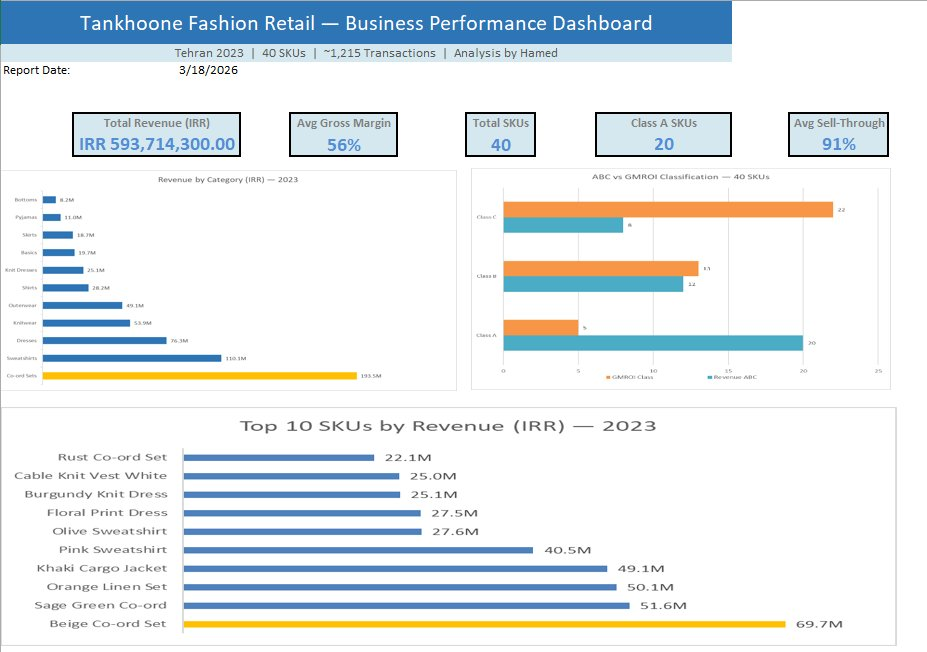

**KPIs:** Total Revenue (593M IRR) · Avg Gross Margin (56%) · Total SKUs (40) · Class A SKUs (20) · Avg Sell-Through (91%)

---

### Operations & Inventory Dashboard
*Audience: Buying Manager & Supply Chain Planner*

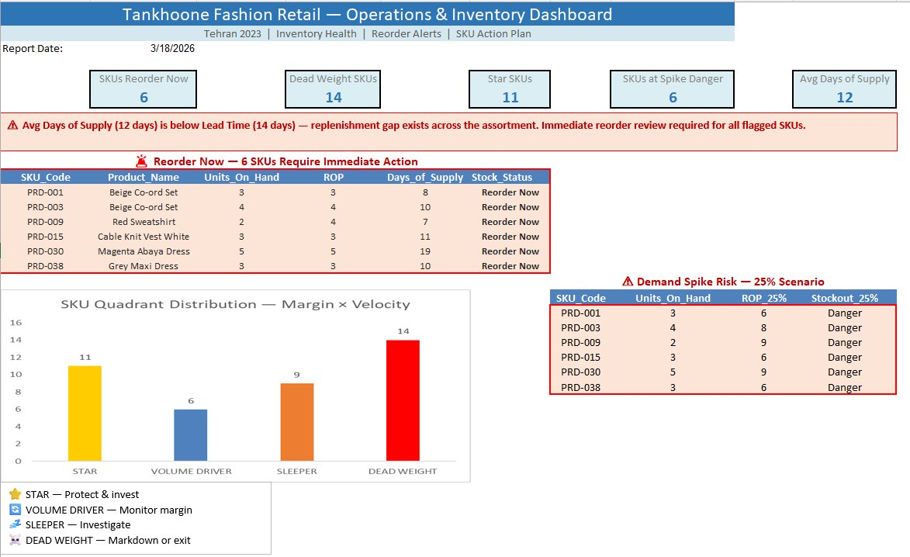

**KPIs:** SKUs Reorder Now (6) · Dead Weight SKUs (14) · Star SKUs (11) · SKUs at Spike Danger (6) · Avg Days of Supply (12)

> ⚠️ **Critical Alert:** Avg Days of Supply (12) is below Lead Time (14). The store cannot replenish stock fast enough to cover current demand.

---

## Key Findings

### 1. Revenue is dangerously concentrated
Co-ord Sets alone account for **33% of total revenue**. The top 20 SKUs drive 70% of all sales. Three Co-ord Set SKUs sit in the top 4 by revenue — category dominance is driven by specific hero products, not broad assortment depth.

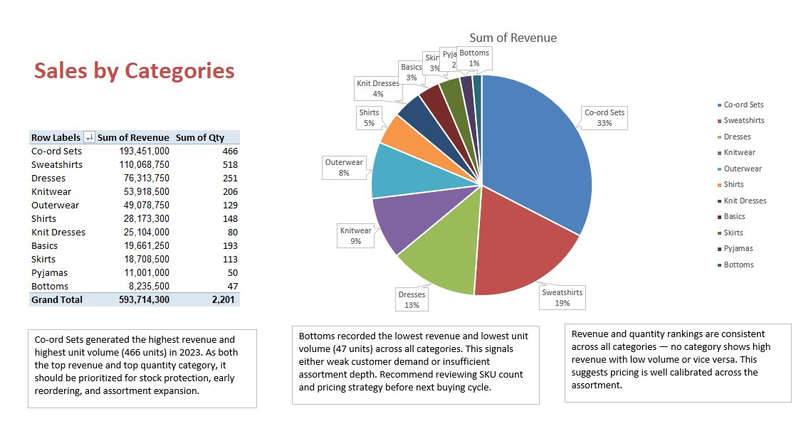

---

### 2. Instagram DM is the primary revenue channel
**41% of total revenue** flows through Instagram DM — more than in-store sales. Investment in Instagram response time and content directly impacts revenue outcomes.

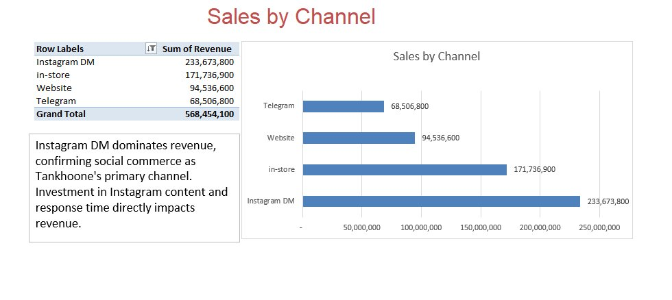

---

### 3. Top 10 SKUs — Concentration risk is real
Revenue drops sharply after the top 4–5 SKUs. Beige Co-ord Set alone generated **69.7M IRR**. If these SKUs stock out, the business loses disproportionate revenue.

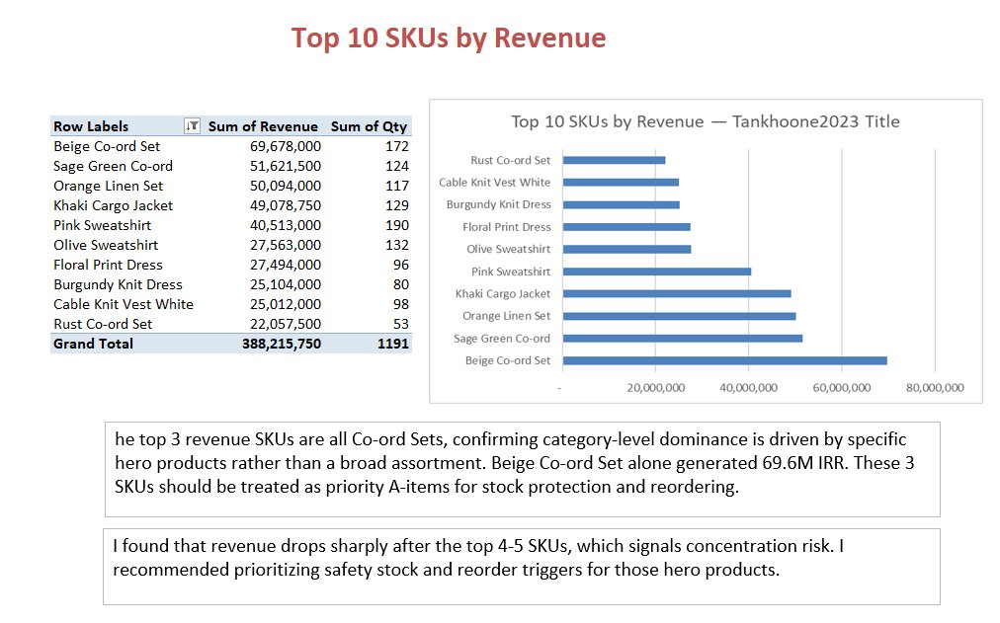

---

### 4. Demand is volatile across every category — no SKU is stable
Every product category shows **High Coefficient of Variation (CV)**. PRD-017 reaches CV = 1.539. Traditional average-based reorder triggers are insufficient.

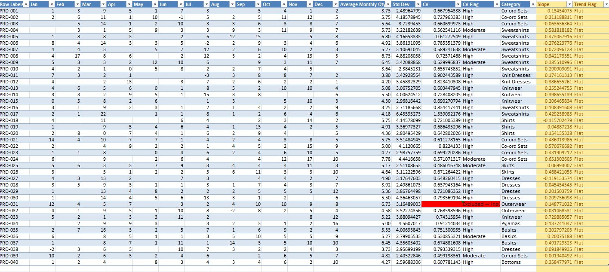

---

### 5. Inventory health — 6 SKUs require immediate reorder
Safety Stock, Reorder Point, and Days of Supply calculated for all 40 SKUs at **95% service level (Z=1.65)**. Six SKUs have already fallen below their Reorder Point.

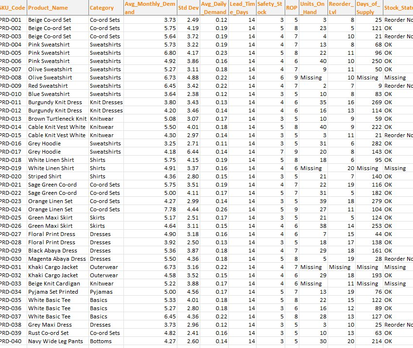

---

### 6. Capital is misallocated — GMROI reveals what revenue hides
Revenue ABC: **20 Class A SKUs**. GMROI-based: only **5 true Class A SKUs**. Twenty-two SKUs are Class C by capital efficiency.

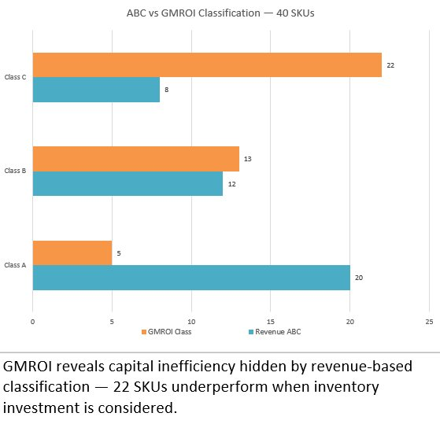

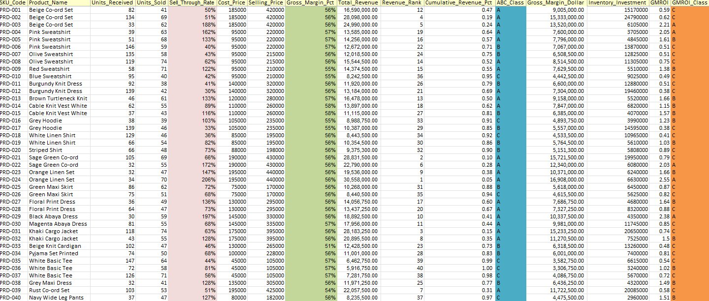

---

### 7. A 25% demand spike immediately threatens 6 SKUs
Even the most conservative spike puts **6 SKUs in immediate Danger** — the same 6 already below ROP.

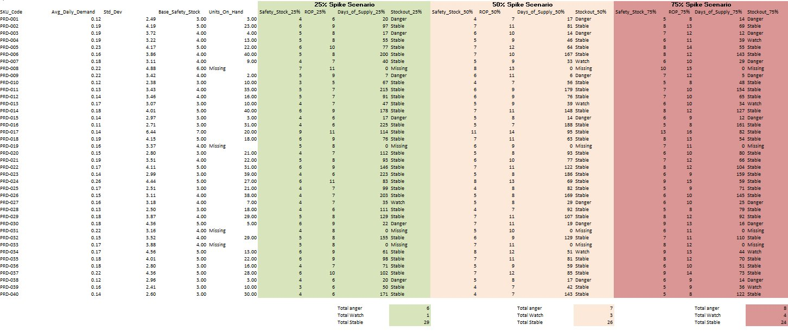

---

### 8. Lead time modeling — ROP more than doubles as supplier delays increase
PRD-017: ROP rises from **8 units at 10-day lead time** to **19 units at 45-day lead time**.

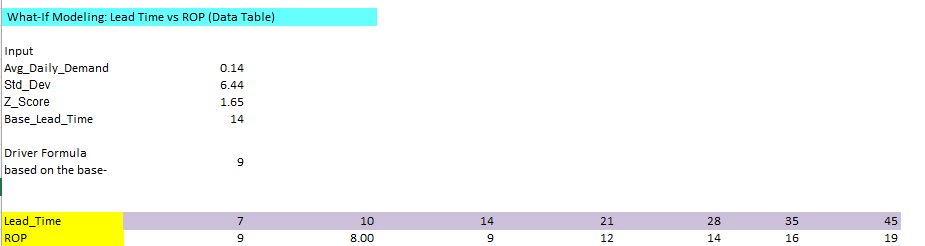

---

### 9. A demand spike burns stock, not buffer
Demand doubles → stockout runway drops from **143 days to 71 days**. The risk is speed of consumption, not buffer size.

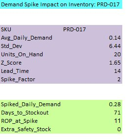

---

### 10. 35% of the assortment is Dead Weight
**11 Stars, 6 Volume Drivers, 9 Sleepers, 14 Dead Weight**. Nearly 60% of the assortment needs action or investigation.

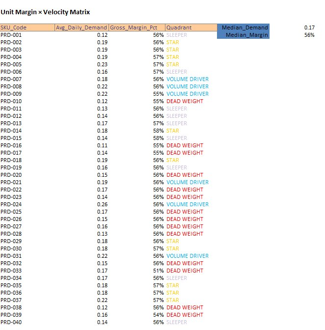

---

## Strategic Recommendations

### 🚨 1. Trigger emergency reorder for 6 critical SKUs today
PRD-001, PRD-003, PRD-009, PRD-015, PRD-030, PRD-038 — below ROP and in Danger under 25% spike.

### 💰 2. Redirect buying capital from Dead Weight to Stars
14 SKUs deliver neither velocity nor margin. Redirect toward the 11 Stars before the next buying cycle.

### 📋 3. Fix the data foundation
4 SKUs missing Units_On_Hand. Order dates not captured. Inventory planning is currently running on assumptions.

---

## Analytical Methods

| Method | Application |
|--------|-------------|
| Coefficient of Variation (CV) | Demand volatility classification per SKU |
| Safety Stock (Z=1.65) | 95% service level buffer calculation |
| Reorder Point (ROP) | Demand × Lead Time + Safety Stock |
| Revenue-Based ABC | Pareto classification — 70/20/10 rule |
| GMROI Classification | Capital efficiency vs revenue performance |
| Sensitivity Analysis | 25/50/75% demand spike scenarios |
| One-Variable Data Table | Lead time vs ROP modeling |
| Unit Margin × Velocity Matrix | 2×2 strategic SKU classification |

---

## Excel Skills Demonstrated

**Formulas:** XLOOKUP · SUMIF · COUNTIF · IFERROR · LET() · Nested IF · AND() · RANK.EQ · MEDIAN · ROUND · SQRT · COUNTA · AVERAGE · SLOPE

**Features:** Pivot Tables · PivotCharts · One-Variable Data Table · Conditional Formatting · Dashboard Design · Paste as Picture

**Concepts:** Mixed & absolute cell references · Cross-sheet formula architecture · Assumption documentation · Multi-audience dashboard design

---

## Repository Contents

```
📁 retail-analytics-portfolio
├── 📊 Tankhoone_Analytics.xlsx          ← Full Excel workbook (8 chapters + 2 dashboards)
├── 📄 Portfolio_Narrative.pdf           ← Written findings and recommendations
├── 🖼️  *.png                            ← All analysis and dashboard screenshots
└── 📖 README.md                         ← This page
```

---

*Hamed Tamjidyamchelo · March 2026 · Toronto, Canada*
